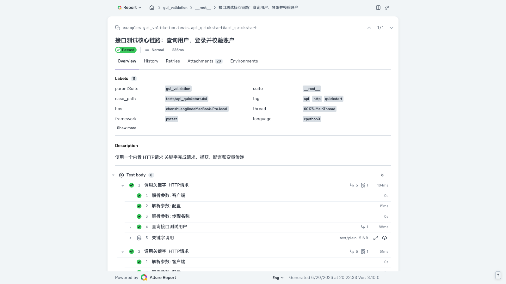
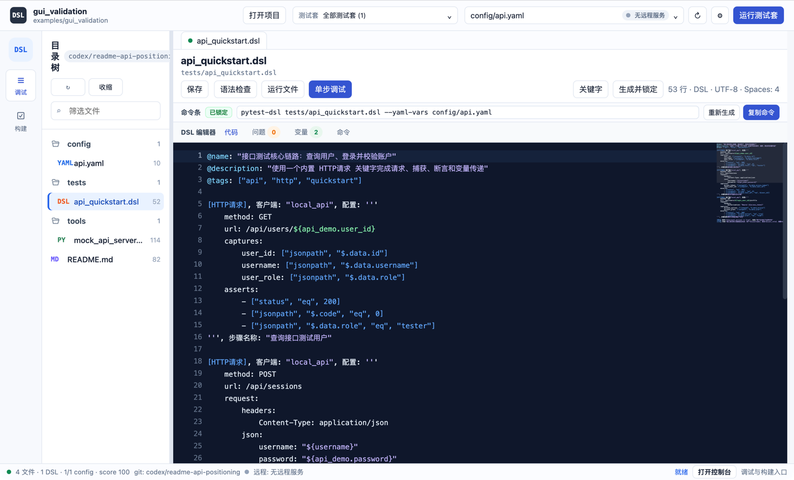
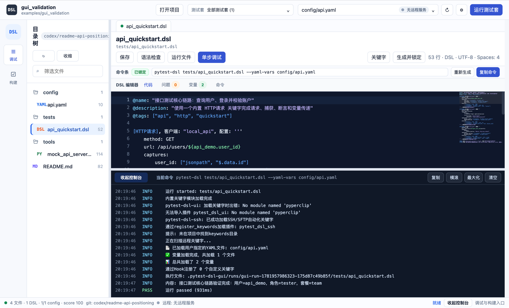

# pytest-dsl：用语法约束测试过程，让接口用例和报告天然可读

[](https://python.org)
[](https://pypi.org/project/pytest-dsl/)
[](LICENSE)

pytest-dsl 是一个基于 pytest 的关键字驱动测试框架。它用 DSL 统一表达测试步骤、参数、变量、控制流和关键字调用，让团队不必只靠代码规范维持用例结构和报告层级。

接口测试是最直接的切入点：内置 `[HTTP请求]` 已把请求配置、响应捕获、断言、会话和 Allure 记录组合成一个可复用关键字。Pytest DSL Studio 则提供可选的项目编辑、运行、调试和报告工作台。

## 为什么是 pytest-dsl

pytest 本身足够灵活，但灵活也意味着用例结构需要团队自行约定。为了得到业务可读的 Allure 报告，常规 pytest 用例通常需要手动维护步骤边界：

```python
import allure


def test_user_login(api_client):
    with allure.step("查询接口测试用户"):
        user_response = api_client.get("/api/users/1001")
        assert user_response.status_code == 200
        username = user_response.json()["data"]["username"]

    with allure.step("登录并捕获访问令牌"):
        login_response = api_client.post(
            "/api/sessions",
            json={"username": username, "password": "pytest-dsl"},
        )
        assert login_response.status_code == 201
        access_token = login_response.json()["data"]["access_token"]

    with allure.step("携带令牌查询账户状态"):
        profile_response = api_client.get(
            "/api/users/1001/profile",
            headers={"Authorization": f"Bearer {access_token}"},
        )
        assert profile_response.json()["data"]["active"] is True
```

这里的请求客户端、字段提取、断言组织和 `allure.step` 都需要项目自行封装并持续约束。pytest-dsl 把这些结构提升到语法和关键字层：

```python
[HTTP请求], 客户端: "local_api", 配置: '''
    method: GET
    url: /api/users/${api_demo.user_id}
    captures:
        username: ["jsonpath", "$.data.username"]
        user_role: ["jsonpath", "$.data.role"]
    asserts:
        - ["status", "eq", 200]
        - ["jsonpath", "$.data.role", "eq", "tester"]
''', 步骤名称: "查询接口测试用户"
```

这不是替代 pytest，而是在 pytest 之上提供统一的测试表达层：

- 用例作者按固定语法描述业务步骤，不需要每个项目重新设计代码骨架。
- 关键字调用、参数解析、变量赋值和控制流形成稳定的执行结构。
- `步骤名称` 直接成为报告中的业务步骤，源码与报告使用同一套命名。
- Python 关键字、pytest 插件、fixture 和命令行生态仍可继续使用。

## 一个关键字开始接口测试

对基础接口用例而言，`[HTTP请求]` 提供的是接近零额外封装成本，而不是“没有任何学习成本”。安装 pytest-dsl 后，无需先实现 requests 客户端、字段提取器、断言包装器或 Allure 附件逻辑，就可以直接描述请求链路。

当前 `[HTTP请求]` 注册参数包括：

- `客户端`：引用 YAML 中的 HTTP 客户端配置，默认值为 `default`；
- `配置`：使用 YAML 描述 method、url、request、captures 和 asserts；
- `会话`：在多个请求之间复用命名会话；
- `保存响应`：将完整响应保存到指定变量；
- `禁用授权`：跳过客户端认证配置；
- `模板`：复用 YAML 中的请求模板；
- `断言重试次数`、`断言重试间隔`：控制断言重试；
- 所有注册关键字共有的 `步骤名称`：控制报告中的业务步骤标题。

一个完整 API 请求链路可以主要使用同一个内置关键字完成；示例最后再用通用 `[断言]` 汇总校验跨请求变量：

```python
@name: "接口测试核心链路：查询用户、登录并校验账户"
@description: "使用一个内置 HTTP请求 关键字完成请求、捕获、断言和变量传递"
@tags: ["api", "http", "quickstart"]

[HTTP请求], 客户端: "local_api", 配置: '''
    method: GET
    url: /api/users/${api_demo.user_id}
    captures:
        user_id: ["jsonpath", "$.data.id"]
        username: ["jsonpath", "$.data.username"]
        user_role: ["jsonpath", "$.data.role"]
    asserts:
        - ["status", "eq", 200]
        - ["jsonpath", "$.code", "eq", 0]
        - ["jsonpath", "$.data.role", "eq", "tester"]
''', 步骤名称: "查询接口测试用户"

[HTTP请求], 客户端: "local_api", 配置: '''
    method: POST
    url: /api/sessions
    request:
        headers:
            Content-Type: application/json
        json:
            username: "${username}"
            password: "${api_demo.password}"
    captures:
        access_token: ["jsonpath", "$.data.access_token"]
        login_user_id: ["jsonpath", "$.data.user_id"]
    asserts:
        - ["status", "eq", 201]
        - ["jsonpath", "$.code", "eq", 0]
        - ["jsonpath", "$.data.user_id", "eq", ${user_id}]
''', 步骤名称: "登录并捕获访问令牌"

[HTTP请求], 客户端: "local_api", 配置: '''
    method: GET
    url: /api/users/${login_user_id}/profile
    request:
        headers:
            Authorization: "Bearer ${access_token}"
    captures:
        account_active: ["jsonpath", "$.data.active"]
        account_plan: ["jsonpath", "$.data.plan"]
    asserts:
        - ["status", "eq", 200]
        - ["jsonpath", "$.data.active", "eq", true]
        - ["jsonpath", "$.data.plan", "eq", "team"]
''', 步骤名称: "携带令牌查询账户状态"

[断言], 条件: "${account_active} == True", 消息: "账户应该处于启用状态"
[打印], 内容: "接口测试核心链路验证完成：用户=${username}，角色=${user_role}，套餐=${account_plan}"
```

可运行源码位于 [`examples/gui_validation/tests/api_quickstart.dsl`](examples/gui_validation/tests/api_quickstart.dsl)。仓库提供本地 mock API，因此这个示例不依赖公网服务。

## 从 DSL 到可读报告

pytest-dsl 的报告层级来自真实执行结构，而不是运行结束后重新拼装文本。上面的示例通过 pytest 原生收集生成 Allure 结果后，实际包含：

1. 顶层用例：`接口测试核心链路：查询用户、登录并校验账户`。
2. 每次 `调用关键字: HTTP请求` 下记录客户端、配置和步骤名称参数解析。
3. `步骤名称` 指定的业务步骤，例如 `登录并捕获访问令牌`。
4. 业务步骤内的 `发送HTTP请求 (客户端: local_api)` 和 `执行断言验证`。
5. `HTTP请求摘要`、`HTTP响应摘要`、`变量捕获摘要` 和 `HTTP断言摘要` 附件。

因此，测试设计中的业务步骤、执行过程和报告阅读顺序保持一致。请求或断言失败时，异常会落在对应关键字和子步骤中，而不是只留下一个缺少上下文的函数失败。



## 从接口测试扩展到端到端

接口测试是 pytest-dsl 最直接的切入点，但关键字模型并不限定测试边界。pytest-dsl 提供类似 Robot Framework 的关键字驱动扩展方式：用例在 DSL 中描述业务流程，具体技术动作封装在可复用关键字中。

团队可以用 `function ... do ... end` 在 DSL 中组合业务关键字，用 `.resource` 文件跨用例复用，也可以通过项目 `keywords/`、Python 注册机制、插件或 XML-RPC 远程服务提供关键字。Python 关键字可以调用现有 Python 库和外部驱动，因此一个流程可以按以下方式组合：

`内置 [HTTP请求] → 团队自定义的页面操作关键字 → 团队自定义的数据校验关键字 → 通用断言和清理步骤`

这使接口准备、界面操作、后台核验和环境收尾可以使用同一套 DSL 业务步骤组织成端到端用例。浏览器、移动端、数据库、消息队列等领域能力需要团队提供对应驱动，并非全部由 pytest-dsl 内置。

这里的“类似”指关键字驱动的组织和扩展方式。pytest-dsl 基于 pytest，继续使用 pytest 的收集、fixture、插件和命令行生态；它不兼容 Robot Framework 的语法、库接口或现有用例，也不是 Robot Framework 的直接替代品。

## Pytest DSL Studio

Pytest DSL Studio 是仓库中的 Electron 桌面工作台，用于降低项目浏览、编辑和执行成本；它不是 pytest-dsl 的必需运行时。

当前工作台提供：

- 递归项目树和 CodeMirror 6 编辑器；
- DSL 关键字检索、插入和定义跳转；
- 语法检查、文件运行和交互式调试；
- 测试集选择及 pytest 构建执行；
- 基于 `--alluredir` 的构建产物和内嵌 Allure 实时报告；
- 运行输出、构建日志和报告导出。

### 编辑 API 用例



### 运行 API 用例



命令行适合 CI 和批量执行，Studio 适合本地编写、排错和查看报告；二者使用同一套 DSL 文件和 pytest-dsl 执行能力。

## 5 分钟运行 API 示例

### 1. 安装 pytest-dsl

```bash
pip install pytest-dsl
```

当前版本要求 Python 3.9 或更高版本。

### 2. 启动仓库内的 mock API

克隆仓库后，在仓库根目录执行：

```bash
python examples/gui_validation/tools/mock_api_server.py
```

服务默认监听 `http://127.0.0.1:8765/`。

### 3. 运行 DSL

另开终端：

```bash
cd examples/gui_validation
pytest-dsl tests/api_quickstart.dsl --yaml-vars config/api.yaml
```

### 4. 生成 Allure 结果

```bash
python -m pytest tests/api_quickstart.dsl \
  --yaml-vars config/api.yaml \
  --alluredir allure-results -q
```

### 5. 可选：启动 Studio

Node.js 20 或更高版本是 Studio 的开发运行环境要求：

```bash
npm install --prefix electron-gui
npm start --prefix electron-gui
```

在 Studio 中打开 `examples/gui_validation`，选择 `config/api.yaml`，再打开 `tests/api_quickstart.dsl`。构建页的内嵌实时报告需要本机可用的 Allure 3 CLI。

更完整的项目说明见 [`examples/gui_validation/README.md`](examples/gui_validation/README.md)。

## 核心能力

### HTTP/API 测试

- YAML 请求配置，支持查询参数、请求头、JSON、表单、文件、Cookie、超时、跳转、证书和代理等 requests 参数。
- JSONPath、XPath、正则、响应头、Cookie、状态码、响应体和响应时间捕获。
- 状态码、JSONPath、响应头、响应体、响应时间和 JSON Schema 等断言组合。
- 客户端配置、认证提供者、命名会话、请求模板和断言重试。
- 请求、响应、捕获和断言的 Allure 摘要；敏感字段在公共报告辅助函数中脱敏。

### DSL 测试表达

- 变量、列表、字典及嵌套访问。
- `if / elif / else`、`for`、`while`、`break` 和 `continue`。
- setup、teardown、重试块和数据驱动。
- `.resource` 资源文件和 DSL 自定义关键字。

### 扩展与集成

- 内置 HTTP 关键字可以与 DSL、Python、插件或远程自定义关键字组合，组织跨接口和外部驱动的端到端业务流程。
- Python 装饰器注册自定义关键字，并声明参数、默认值、分类和返回值。
- 本地关键字和 XML-RPC 远程关键字调用。
- pytest 原生 `.dsl` / `.auto` 收集、fixture 和插件生态。
- Allure 报告、命令行运行和 Studio 工作台使用同一执行核心。

## 文档

- [快速开始](docs/guide/getting-started.md)
- [HTTP 接口测试](docs/guide/http-testing.md)
- [DSL 语法](docs/guide/dsl-syntax.md)
- [自定义关键字](docs/guide/custom-keywords.md)
- [远程关键字](docs/guide/remote-keywords.md)
- [测试报告](docs/guide/reporting.md)
- [Studio API 验证项目](examples/gui_validation/README.md)

## 运行测试

```bash
python -m pytest
npm run check --prefix electron-gui
```

README 中的历史教程已移到专题文档。新增或修改首页示例时，应同时提供可运行文件和回归验证。

## 贡献

欢迎通过 [Issues](https://github.com/felix-1991/pytest-dsl/issues) 报告问题，或通过 [Pull Requests](https://github.com/felix-1991/pytest-dsl/pulls) 提交改进。

## 许可证

本项目使用 [MIT License](LICENSE)。
