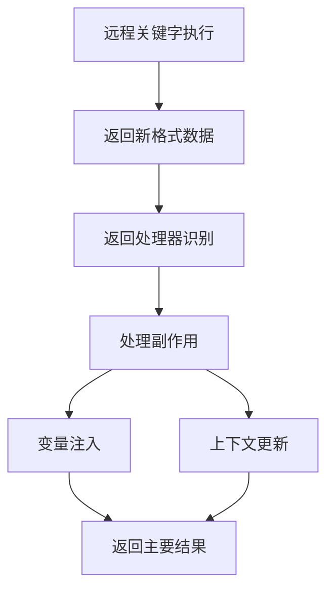

# 简化后的远程关键字返回处理设计

## 设计简化

根据用户反馈，我们简化了设计，移除了不必要的复杂性：

### 移除的内容
1. **自定义处理器机制** - 移除了 `custom_handlers` 相关逻辑
2. **兼容层** - 不再需要旧格式兼容，统一使用新格式
3. **复杂的格式转换** - 直接处理副作用，不再转换格式

### 保留的核心功能
1. **变量注入** - `side_effects.variables`
2. **上下文更新** - `side_effects.context_updates`
3. **插件化处理器** - 支持不同类型关键字的专用处理

## 统一的返回格式

```python
{
    "result": actual_result,           # 主要返回值
    "side_effects": {                  # 副作用处理
        "variables": {...},            # 变量注入
        "context_updates": {...}       # 上下文更新
    },
    "metadata": {...}                  # 元数据
}
```

## 处理流程



## 核心实现

### 1. 远程关键字客户端处理

```python
def _process_return_data(self, return_data):
    """处理返回数据"""
    processed_data = return_handler_registry.process(return_data)
    
    # 直接处理副作用
    if isinstance(processed_data, dict) and 'side_effects' in processed_data:
        self._handle_side_effects(processed_data)
        return processed_data.get('result')
    else:
        return processed_data

def _handle_side_effects(self, processed_data):
    """处理副作用"""
    side_effects = processed_data.get('side_effects', {})
    
    # 变量注入
    variables = side_effects.get('variables', {})
    if variables:
        self._inject_variables(variables)
        
    # 上下文更新
    context_updates = side_effects.get('context_updates', {})
    if context_updates:
        self._update_context(context_updates)
```

### 2. HTTP关键字统一格式

```python
def http_request(...):
    # 执行HTTP请求
    response = execute_request()
    
    # 统一返回新格式
    return {
        "result": captured_values,
        "side_effects": {
            "variables": captured_values,
            "context_updates": {
                "session_state": session_state,
                "response": response_data
            }
        },
        "metadata": {
            "keyword_type": "http_request",
            "status_code": response.status_code
        }
    }
```

### 3. 变量注入实现

```python
def _inject_variables(self, variables):
    """注入变量到执行器上下文"""
    current_executor = self._get_current_executor()
    
    for var_name, var_value in variables.items():
        if var_name.startswith('g_'):
            # 全局变量
            global_context.set_variable(var_name, var_value)
        else:
            # 本地变量
            if current_executor:
                current_executor.variable_replacer.local_variables[var_name] = var_value
                current_executor.test_context.set(var_name, var_value)
```

## 优势

### 1. 简化的架构
- 移除了不必要的复杂性
- 统一的处理流程
- 更清晰的代码结构

### 2. 直接的副作用处理
- 不再需要格式转换
- 直接处理变量注入和上下文更新
- 更高的执行效率

### 3. 易于扩展
- 保留了插件化的返回处理器机制
- 支持新类型关键字的专用处理
- 清晰的扩展点

## 使用示例

### 创建新的远程关键字

```python
def my_database_keyword(query: str):
    """数据库查询关键字"""
    result = execute_query(query)
    
    return {
        "result": result,
        "side_effects": {
            "variables": {
                "last_query_result": result,
                "query_count": len(result)
            },
            "context_updates": {
                "db_connection": {"last_query": query}
            }
        },
        "metadata": {
            "keyword_type": "database_query",
            "affected_rows": len(result)
        }
    }
```

### 创建自定义返回处理器

```python
class DatabaseReturnHandler(RemoteReturnHandler):
    def can_handle(self, return_data):
        return (return_data.get('metadata', {}).get('keyword_type') == 'database_query')
    
    def process(self, return_data, context=None):
        # 数据库关键字已经使用新格式，直接返回
        return return_data
    
    @property
    def priority(self):
        return 15
```

## 测试验证

所有核心功能都通过了测试验证：

- ✅ 变量注入（全局和本地）
- ✅ 上下文更新
- ✅ 副作用处理
- ✅ 返回处理器机制
- ✅ 线程本地执行器访问

## 总结

简化后的设计：

1. **更简洁** - 移除了不必要的复杂性
2. **更直接** - 直接处理副作用，不需要格式转换
3. **更高效** - 减少了中间处理步骤
4. **更清晰** - 统一的格式和处理流程
5. **易扩展** - 保留了核心的扩展机制

这个设计专注于核心需求：变量注入和上下文更新，为远程关键字提供了一个简洁而强大的副作用处理机制。
